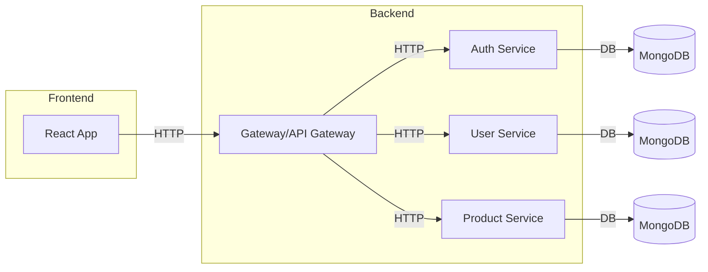
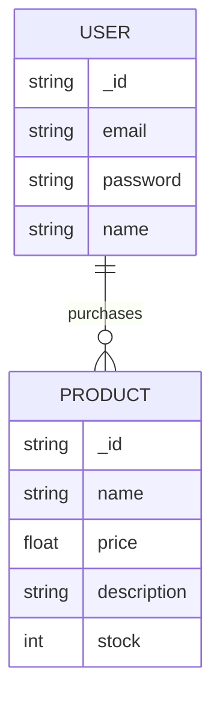

# Microservice-BE-FE-  

## Introduction
Microservice-BE-FE- is a full-stack system that demonstrates a microservice architecture, combining both backend and frontend components. The repository is designed for scalable, modular development, and shows how to implement, connect, and orchestrate microservices with a modern frontend. This project targets developers and teams interested in building distributed systems using microservices and exploring best practices in API design, authentication, and service communication. The frontend uses ReactJS and the backend uses Laravel.

---

## Features
- Modular microservice architecture for scalability and maintainability
- RESTful APIs for communication between services
- User authentication and authorization
- Centralized configuration and service discovery
- Modern frontend to interact with backend services
- Docker support for easy deployment

---

## Technology Stack
- **Backend:** Node.js, Express, MongoDB, JWT, Docker
- **Frontend:** React, Redux, Axios, Material UI
- **Infrastructure:** Docker Compose, NGINX (optional for reverse proxy)
- **Other Tools:** Postman (for API testing), ESLint, Prettier

---

## Architecture Overview
The project follows a microservice structure, where each service is self-contained, responsible for a specific domain, and communicates over REST APIs. The frontend is decoupled and consumes APIs from the backend services.



---

## Getting Started

### Prerequisites
- Node.js (v16+)
- Docker and Docker Compose
- MongoDB (if running without Docker)
- npm or yarn

### Installation Steps

1. **Clone the repository**
   ```bash
   git clone https://github.com/kiel24k/Microservice-BE-FE-.git
   cd Microservice-BE-FE-
   ```

2. **Environment configuration**
   - Copy `.env.example` files to `.env` in each service directory and fill with your configuration.

3. **Run with Docker (recommended)**
   ```bash
   docker-compose up --build
   ```

4. **Run locally (development)**
   - Start each backend service:
     ```bash
     cd backend/services/auth
     npm install
     npm run dev
     # Repeat for other services
     ```
   - Start the frontend:
     ```bash
     cd frontend
     npm install
     npm start
     ```

---

## Microservices Structure

### Backend

- **Auth Service**: Handles user registration, login, JWT issuance, and password management.
- **User Service**: Manages user profiles, updates, and user-specific data.
- **Product Service**: Manages product catalog, CRUD operations, and inventory.
- **API Gateway**: Routes requests to appropriate services, handles authentication, and aggregates responses.

### Frontend

- **React Application**: Responsive SPA for user interactions, authentication, and data visualization. Uses Redux for state management.

---

## API Documentation

Below are sample API endpoints for each service. Each endpoint includes method, route, parameters, request, and response examples.

### Auth Service

```api
{
    "title": "Register User",
    "description": "Create a new user account",
    "method": "POST",
    "baseUrl": "http://localhost:4001",
    "endpoint": "/api/auth/register",
    "headers": [],
    "queryParams": [],
    "pathParams": [],
    "bodyType": "json",
    "requestBody": "{\n  \"email\": \"user@example.com\",\n  \"password\": \"Secret123\"\n}",
    "responses": {
        "201": {
            "description": "User created",
            "body": "{\n  \"token\": \"<jwt-token>\",\n  \"user\": {\"id\": 1, \"email\": \"user@example.com\" }\n}"
        },
        "400": {
            "description": "Validation error",
            "body": "{\n  \"error\": \"Email already exists\"\n}"
        }
    }
}
```

```api
{
    "title": "Login User",
    "description": "Authenticate user and return JWT token",
    "method": "POST",
    "baseUrl": "http://localhost:4001",
    "endpoint": "/api/auth/login",
    "headers": [],
    "queryParams": [],
    "pathParams": [],
    "bodyType": "json",
    "requestBody": "{\n  \"email\": \"user@example.com\",\n  \"password\": \"Secret123\"\n}",
    "responses": {
        "200": {
            "description": "Authenticated",
            "body": "{\n  \"token\": \"<jwt-token>\"\n}"
        },
        "401": {
            "description": "Unauthorized",
            "body": "{\n  \"error\": \"Invalid credentials\"\n}"
        }
    }
}
```

### User Service

```api
{
    "title": "Get User Profile",
    "description": "Retrieve current user's profile",
    "method": "GET",
    "baseUrl": "http://localhost:4002",
    "endpoint": "/api/users/me",
    "headers": [
        {
            "key": "Authorization",
            "value": "Bearer <token>",
            "required": true
        }
    ],
    "queryParams": [],
    "pathParams": [],
    "bodyType": "none",
    "responses": {
        "200": {
            "description": "Profile data",
            "body": "{\n  \"id\": 1, \"email\": \"user@example.com\", \"name\": \"User Name\"\n}"
        },
        "401": {
            "description": "Unauthorized",
            "body": "{\n  \"error\": \"Token missing or invalid\"\n}"
        }
    }
}
```

### Product Service

```api
{
    "title": "Get All Products",
    "description": "Retrieve a list of all products",
    "method": "GET",
    "baseUrl": "http://localhost:4003",
    "endpoint": "/api/products",
    "headers": [],
    "queryParams": [],
    "pathParams": [],
    "bodyType": "none",
    "responses": {
        "200": {
            "description": "Product list",
            "body": "[{\"id\":1,\"name\":\"Product 1\",\"price\":100}]"
        }
    }
}
```

---

## Database Model

The backend services use MongoDB, with each service managing its own collections. The models are simple and focused on the service domain.



---

## Deployment

### Using Docker Compose

1. Ensure Docker is installed and running.
2. Start all services:
   ```bash
   docker-compose up --build
   ```
3. Access the frontend at `http://localhost:3000` (default).

### Manual Deployment

- Deploy backend and frontend services separately.
- Update environment variables for production.
- Use NGINX or another reverse proxy for routing and SSL.

---

## Configuration

- Each service uses its own `.env` file for configuration.
- Common variables: `PORT`, `MONGO_URI`, `JWT_SECRET`, `SERVICE_URLS`.
- API Gateway requires URLs for each backend service.

---

## Security Considerations

- JWT for stateless authentication.
- Passwords are hashed before storing.
- API Gateway centralizes authentication and input validation.
- CORS is properly configured on backend services.
- Rate limiting and input validation can be enabled.

---

## Testing

- Unit tests present for core logic in services.
- Use Postman collections for API integration testing.
- Run backend tests:
  ```bash
  npm test
  ```
- Frontend tests:
  ```bash
  npm run test
  ```

---

## Contributing

- Fork the repo and create a new feature branch.
- Write clear, concise commit messages.
- Ensure all tests pass before submitting a PR.
- Follow the code style and linting rules.

---

## License

This project is licensed under the MIT License. See the [LICENSE](./LICENSE) file for details.

---

## Contact

For issues, questions, or suggestions, open an issue on GitHub or contact the maintainer at kiel24k.

---

## Acknowledgments

- Inspired by popular microservice patterns
- Uses open-source tools from the Node.js and React communities
- Thanks to contributors and testers for their input

---
